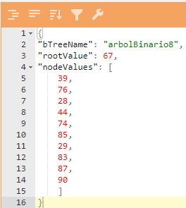
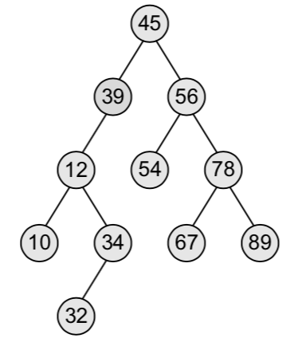

# bTreeWebApi
_Proyecto realizado para realizar creación, visualización y cálculo del ancestro más cercano sobre arboles binarios. Este proyecto expone tres servicios que son:_

**getBtrees**: Permite obtener los nombres de los arboles creados anteriormente.

**createBTree**: Permite crear un nuevo árbol binario a partir de 3 parámetros.

**lca**: Permite calcular el ancestro común mas cercano de un árbol binario a partir de 3 parámetros.

## Crear un árbol binario(createBTree)
Este servicio se encarga de crear un árbol binario a partir de tres parámetros: 

* **[string] Nombre del árbol**: Corresponde al nombre del árbol como se almacenará en base de datos. 

* **[int] Nodo principal**: Valor del nodo principal o raíz del árbol binario.

* **[List<int>] Lista de nodos**: Lista de enteros con los nodos que se van a indexar en el árbol binario.

Para utilizar este servicio se debe realizar una petición de tipo POST a la siguiente URL:

http://btreewepapi.azurewebsites.net/createBTree

Y la estructura del BODY de la petición debe ser un JSON asi:

La metodología para la creación del árbol binario consiste en: a partir del nodo principal, se analiza el valor del siguiente nodo a agregar, si el valor del nuevo nodo es mayor o igual al nodo actual se agregará en la rama de la derecha, en caso contrario se agregará el nuevo nodo en la rama de la izquierda. Este mismo proceso se repite para todos los nodos y se va recorriendo el arbol hasta agregar el nuevo nodo. En la siguiente imagen se muestra la estructura del árbol binario.

## Obtener los arboles binarios creados(getBtrees)

Este servicio se encarga de listar los nombres de los arboles binarios creados anteriormente. Para esto se debe realizar una petición de tipo GET a la siguiente URL:

http://btreewepapi.azurewebsites.net/getBtrees

## Obtener el ancestro común mas cercano(lca)

Este servicio se encarga de calcular el ancestro común mas cercano a partir de tres parámetros: 

* **[String] bTreeName** : Corresponde al nombre del árbol como se almacenará en base de datos. 

* **[int] Node1**: Corresponde a uno de los nodos que se desea calcular el ancestro común mas cercano.

* **[int] Node2**: Corresponde al otro nodo que se desea calcular el ancestro común mas cercano.

Para utilizar este servicio se debe realizar una petición de tipo GET con los parámetros mencionados anteriormente a la siguiente URL:

http://btreewepapi.azurewebsites.net/lca?bTreeName=duquesinho&node1=87&node2=74

_Los parámetros de este servicio se envian sobre la URL separados por el operador '&'_

## Tecnologías empleadas
Para el desarrollo de este proyecto se utilizaron las siguientes herramientas:

* [.NET CORE2.2](https://dotnet.microsoft.com/download/dotnet-core) - Framework utilizado para desarrollar el proyecto.
* [Azure SQL Database](https://azure.microsoft.com/es-es/services/sql-database/) - Base de datos.
* [App services](https://azure.microsoft.com/es-es/services/app-service/) - Alojamiento del proyecto.

